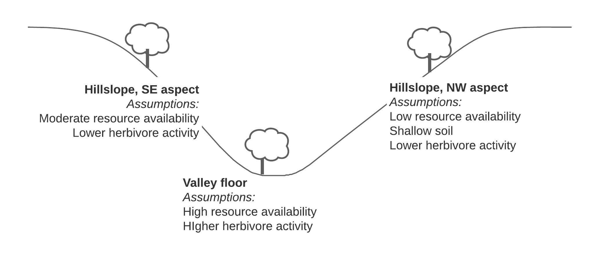
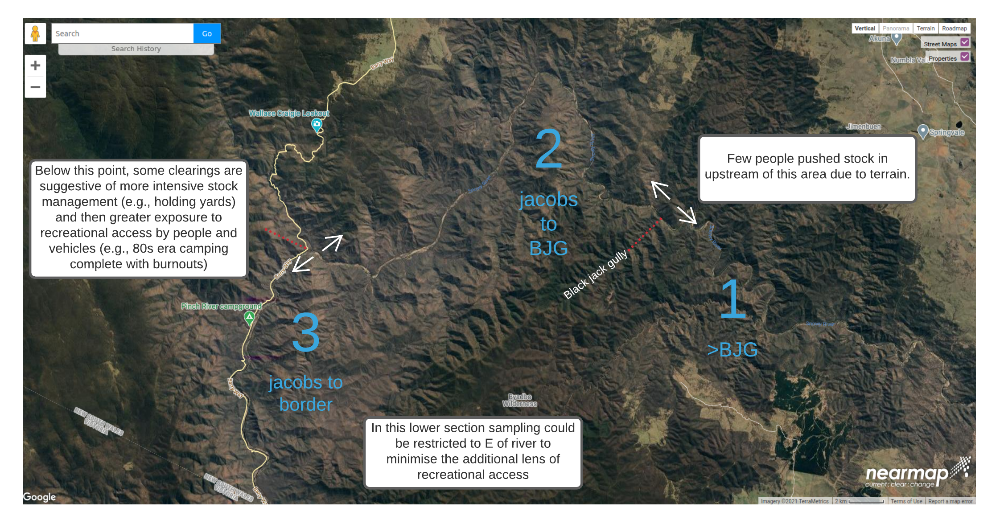

## Acknowledgments

Lenehan
Pulsford, Ward-Jones
Chris Griffiths
Tristan Ricketson
Pam O'Brien

This document was based on the Draft Ecology and Conservation Modelling Preregistration Template by Chris Jones and Elliot Gould. Look out for their project at xxxx.

# 1. Problem Statement

## 1.1 Study context and Purpose

### 1.1.1. Key Stakeholders
This research project pre-registration proposes an investigation on the Country of the Monaro Ngarigo people, Traditional Custodians of land including the southern section of Kosciuszko National Park, NSW, Australia.  The application of the concept of significant cultural values described here is informed by people who speak for that Country and their trusted contacts.   
The ongoing custodianship of the Monaro Ngarigo people is acknowledged by NSW Department of Planning, Industry and Environment's National Parks and Wildlife Service (NPWS) through a Memorandum of Understanding for joint management of the southern section of Kosciuszko National Park [@mou2016].

### 1.1.2 The problem, and purpose of this study

Feral herbivores pose a serious threat to Australian ecosystems and native biodiversity [@kearney19], including our species and ecological communities threatened with extinction or collapse. There is far less attention to how those herbivores may threaten significant cultural values of landscape for Aboriginal Australians, whose custodianship of the land was responsible for the biological diversity of which all Australians are proud.  

The landscape and riverscape of the lower Snowy River Valley has by many published and anecdotal accounts been increasingly impacted by feral herbivores [@blay_unpub]. Recent dung counts from a set of exclosures established in the 1980s to distinguish between the impacts of rabbits and kangaroos instead tell the story of the increasing dominance of horse and deer [@ward-jones19]. Even after a period of drought followed by fierce wildfire, feral horse numbers in Kosciuszko National Park were estimated at 14,000 in Spring, 2020 [@malone2021_news]. Deer populations have also been expanding through the area and Herbivore signs are everywhere from the valley floor to the stony ridges.

This study will examine the relationship between vertebrate herbivores - feral and native - and the regeneration of kurrajong (_Brachychiton populneus_), a tree species that exemplifies the living connection of Monaro Ngarigo people to Country. A focus on one particular cultural value risks missing the point of the deep and encompassing spiritual connection of those people to Country as a living whole [@kawg2006], but at least this particular example of a tree species may encourage readers to think of living cultural connection to landscape rather than a historical presence evoked by a focus on physical artifacts.

The kurrajong is a 'culturally significant species' (_sensu_ @irg2020), an important resource providing food (seeds, new leaf buds), fibre (fish nets, string), gum, and the possibility of water in hard times whose  value for Aboriginal Australians has been documented for a long time (e.g., [@maiden1889]). Kurrajong is widely distributed in south-eastern Australia and is not considered at strong risk of extinction, but global scarcity is not a criterion for cultural significance [@irg2020]. For Monaro Ngarigo people kurrajong probably signified no less than food and fibre, and probably more. The canopy of large individuals provide remarkable cooler and moister conditions than the surrounding rain-shadow woodlands (author's observation), and kurrajong are reported to have been placed and encouraged in certain locations, either through translocation of seedlings, or dispersal of seed [@silcock2018]. That practice may explain in part the current day distribution of large old kurrajong dotted through the lower Snowy River valley including up into the drier slopes.

In order to manage the herbivore threat to a particular value, one would ideally know the relationship between herbivore population density and the impact on that value [@yokomizo2009, @norbury2015]. These density-impact functions could take a range of forms (e.g., @norbury2015] and knowing which is applicable has enormous practical implications for managers. A highly sensitive function might suggest that only reducing herbivore populations to very low density will adequately protect the value (e.g., @mutze2016 for rabbits), whereas for a relatively insensitive function, avoiding irruptive population growth is adequate.  An understanding of the density-impact function therefore allows a decision-maker to design an intervention likely to achieve the required benefit with the minimum financial cost [@yokomizo2009] and minimum destruction of herbivores. This latter point is vitally important as the removal or destruction of feral horses is controversial.

A density-impact function requires that the value that is being impacted be clearly defined. The problem that high densities of feral herbivores may pose for kurrajong is persistent failure to establish a healthy new cohort of saplings. Mature old kurrajong are venerated, but kurrajong offer useful resources from sapling age: supple fibre could be easier to extract from the bark of saplings than from older individuals, and fresh leaf buds could be easily plucked for eating from accessible low foliage. Thus, the demographic structure of kurrajong at a point in time, and evidence for the survival and growth of emerging generations (the cultural connection through the value being maintained), represent the scope of an operational definition of the response value for this study.

We proposean observational study to examine the relationship between vertebrate herbivore activity and the demographic structure and seedling survival of kurrajong in the lower Snowy River Valley. The study will be limited to locations where veteran kurrajong are found on the basis that those locations represent the most likely site where seedling establishment and progression through sapling phase to maturity would have occurred. If a strong association between herbivore activity and demographic or seedling frequency and condition is found, we will explore what levels of herbivore activity (a proxy for density) present a threat to ongoing population stability.

### 1.1.3 Research questions and hypotheses
Is kurrajong demographic structure related to feral herbivore activity?  If feral herbivores affect demographic structure, then all else being equal, higher herbivore activity will reliably 'predict' sites where veteran kurrajong are accompanied by few seedlings and saplings, and those saplings will show signs of having been repeatedly browsed or damaged.

 

Veteran kurrajong are to be found on the valley floor and hillslopes in the lower Snowy Valley corridor up to around 750 m altitude (Fig. 1).  Considerable variation in soil depth, nutrition, and water availability is expected across that natural gradient from mild slope --> valley floor --> exposed harsh slope, and that variation would be expected to influence inherent germination and survival probabilities for kurrajong seedlings in a hypothetical herbivore free setting, and also influence herbivore activity (better resource availability promoting foraging opportunity, therefore higher activity). 

A main effect of sample location on kurrajong demographic structure and seedling survival is anticipated, and a main effect of herbivore activity.  An interaction is expected whereby relatively less herbivore activity in lower resource locations has a disproportionately high impact on kurrajong demographic structure and seedling survival.

### 1.1.3 Response variables

Population structure - what is that? eveness? 

Seedling density

Seedling intactness

Sapling intactness

fseedlings ~ topographic position + river section + deer activity + horse activity + macropod activity
fseedling&sapling damage ~ topographic position + river section + deer activity + horse activity + macropod activity
biomass_them  ~ topographic position + river section + deer activity + horse activity + macropod activity

- *After answering these questions with relevant stakeholders, please describe and define your response variable(s).*

# 2.0 Conceptual Model and Study Design

## 2.1 Conceptual Model Representation and Elicitation Method

Our conceptualisation of the problem is informed by a field trip undertaken by the authors to the southern part of Koscsiuszko National Park in December, 2020. In addition, author RS has a long association with the landscape recreationally, working as a professional river guide, and working as a contractor to the parks management agency. The proposal, laying out the model has been referred to NPWS (the park manager) and to the representatives of the Monaro-Ngarigo clan on the Executive Advisory Committee. 

### 2.2.1 Critical Conceptual Design Decisions

One of the unavoidable complications that Ian Pulsford has emphasised is the legacy of livestock damage.  The current day impacts of feral herbivores is superimposed on whatever legacies of the era when stock where driven into the system. There is no getting around that, though perhaps we could try to replicate the design further upstream beyond around Black Jack Gully where apparently the evidence of stock droving is far less.  The image below indicates three sections of the Snowy corridor that might have different patterns of use.

We could try to include some consideration of an understorey indicator species attractive to herbivores, like the native pea Swainsona, or kangaroo grass. I like the idea but fear it might be too much to try and squeeze in.

*List and explain critical conceptual design decisions, including:*

-   *spatial and temporal scales,*
-   *selection of entities and processes,*
-   *representation of stochasticity and heterogeneity,*
-   *consideration of local versus global interactions, environmental drivers, etc.*
- *Explain and justify the influence of particular theories, concepts, or earlier models against alternative conceptual design decisions that might lead to alternative model structures .*

### 2.2.2 Model assumptions and uncertainties

*Specify key assumptions and uncertainties underlying the model design, describing how uncertainty and variation will be represented in the model. Sources of uncertainty may include:*

-   *exogenous uncertainties affecting the system,*
-   *parametric uncertainty in input data and*
-   *structural / conceptual nonparametric uncertainty in the model.*

## 2.3 Predictor Variables

*Identify and define system system variables and structures, referencing scenario definitions, and the scope of the model as described within problem formulation (1.1.3):*

-   *What variables would support taking this action or making this decision?*
-   *What additional variables may interact with this system (things we can't control, but can hopefully measure)?*
-   *What variables have not been measured, but may interact with the system (often occurs in field or observational studies)?*
-   *What variables are indice or surrogate measures of variables that we cannot or have not measured?*
-   *In what ways do we expect these variables to interact (model structures)?*

## 2.4 Define prior knowledge, data specification and evaluation
This pre-registration 
*This section should specify the plan for collecting, processing and preparing data available for parameterisation, determining model structure, and for scenario analysis.*

### 2.4.1 Document data sources

Lenehan (unpublished data) [@lenehan2011]

Control info for deer

Dave Berman

That study from gippsland Ami provided

**For pre-existing data (delete as appropriate):**

-   *For each dataset, is the data open or publicly available? (Y/N)*
-   *How can the data be accessed? Provide a link or contact as appropriate, indicating any restrictions on the use of data.*
-   *Date of download, access, or future access:*
-   *Describe the source of the data - what entity originally collected this data? (National Data Set, Private Organisational Data, Own Lab Collection, Other Lab Collection, External Contractor, Meta-Analysis, Expert Elicitation, Other).*
-   *Codebook and meta-data. If a Codebook or other meta-data is available, please link to it here and / or upload the document(s).*

-   *Unpublished Prior Research Activity - Describe any prior but unpublished research activity using these data. Be specific and transparent.*
-   *Prior knowledge of the current dataset - Describe any prior knowledge of or interaction with the dataset before commencing this study. For example, have you read any reports or publications about this data?*

## 2.5 Sampling Plan
Veteran kurrajong are to be found on the valley floor and hillslopes in the lower Snowy Valley corridor up to around 750 m altitude.  Considerable variation in soil depth, nutrition, and water availability is expected across that natural gradient from mild slope --> valley floor --> exposed harsh slope, and we will sample in each because we are interested in whether the activity-impact on demographic structure and seedling survival relationship is consistent or not (see Fig. 1).

This study aims to explore whether the contemporary pattern of herbivore activity may threaten kurrajong regeneration and future population replacement, but there are other important factors in our study area that may exert an influence.

The study area has been exposed to various kinds of vertebrate herbivore pressure over more than 100 years, including management of cattle and sheep. The legacy effects of historical phases of managed and wild herbivore access are unavoidable, but we may shed some light on this by replicating the sample design in various positions through the lower Snowy River corridor (see Fig. 2).  Certain indices of intactness suggest that early droving activity was concentrated below Black Jack's Creek, and that below where the river meets the road additional impacts from car-based access are possible.

## 2.6 Data collection procedures

Data collection would occur ideally in a Spring season for ease of identification of vascular plants.

Data collection will be based on a 50 m x 10 m quadrat centred on a veteran kurrajong (see Fig. 1).  The quadrat size was largely determined with dung detection in mind, following conversation with Dave Berman, and the work of Joanne Lenehan [-@lenehan2011] at Guy Fawkes National Park.

__Identification of veteran kurrajong__
We will select veteran kurrajong individuals in as objective a manner as we can, though the practical difficulties in reaching some parts of the study area will impose some limits.  

Initially, we will try to identify prospective locations based on aerial imagery, at least for the hillslope sites, as kurrajong canopy tends to stand out bright green from the subdued canopy tones of the dominant species yellow box, white box and native pine.    That process will be augmented to achieve the desired sample size by stopping the vehicle at predetermined locations and sampling the nearest veteran individual in the desired hillslope / valley floor location. 

__Rationale for excluding prospective quadrat locations__
Outside of any restrictions imposed by the NPWS who would issue the research permit, or field safety risk mitigation concerns, we don't foresee a reason to exclude pre-selected locations or individuals, unless there turns out to be no veteran kurrajong present.

__Transect position__
The transect would - as a starting proposition - be oriented to align with the principal direction of resource movement, i.e., aligned to the slope on the hill sites, and to the stream on the valley floor.  The idea being that seeds may disproportionately accumulate downstream or down-slope. However, given that the hillslopes are quite steep, if deer and horse are thought to approach likely foraging opportunities along the contour then there may be an argument to align the hillslope transects perpendicular to the slope.

### 2.4.2 Data Processing and Preparation

*Describe any data preparation and processing steps, including manipulation of environmental layers (e.g. standardisation and geographic projection) or variable construction (e.g. Principal Component Analysis).*

Numeric predictors will be centered and scaled to facilitate comparison of coefficients (effect sizes).

The seedling damage variable will most likely require coding as an ordinal variable where 0 = no damage... n = seedling presumed dead.

### 2.4.3 Data Exploration or preliminary data analyses

The field data should be examined to identify any values that 

*For each separate preliminary or investigatory analysis:*

-   *State what needs to be known to proceed with further decision-making about the modelling procedure, and why the analysis is necessary.*
-   *Explain how you will implement this analysis, as well as any techniques you will use to summarise and explore your data.*
-   *What method will you use to represent this analysis (graphical, tabular, or otherwise, describe)*
-   *Specify exactly which parts of the data will be used.*
-   *Describe how the results will be interpreted, listing each potential analytic decision, as well as the analysis finding that will trigger each decision, where possible.*

### 2.4.4 Data evaluation, exclusion, and missing data

A random sample of 10% of field collected observations will be checked against the transcribed digital dataset to identify errors.

All variables will be plotted to verify plausible shape and range.

Some studies that use dung as an activity measure have to account for the way that animnal behaviour and signalling can manifest in depositions. For example, latrine sites for rabbits [e.g., @Mutze], and dung heaps produced by stallions [e.g., REF - Lenehan??] may need to be ommitted or rescaled so that the extreme accumulation does not inflate estimates of animal density. 

# 3.0 Analysis Plan

## 3.1 Model Class, Framework and Approach

The data will be analysed using generalized linear mixed models, where the observations are nested within topographic position (see sampling concept.png)  and river section (see aerial.png)

Seedling No ~ poisson distributed variable with parameter lambda, the mean number encountered per unit area.

log(lambda) = soil temperature / moisture + deer activity index + horse activity index + macropod activity index +  (river section landscape position)

Seedling damage, an ordinal variable, where the log odds of being in a higher damage class is a function of soil temperature / moisture + deer activity index + horse activity index + macropod activity index + (river section landscape position)

Analysis of the demographic structure may be exploratory only as the number of individuals per quadrat may be insufficient to characterise the distribution function of numbers against size/age.

### 3.1.1 Operationalising Model Variables

-   *Specify how you will operationalise the response variables in the model. This should relate directly to the analytical and or management objectives specified during the problem formulation phase. Operationalisations could include:*
    -   *the extent of a response,*
    -   *an extreme value,*
    -   *a trend,*
    -   *a long-term mean,*
    -   *a probability distribution,*
    -   *a spatial pattern,*
    -   *a time-series,*
    -   *qualitative change, such as a direction of change or*
    -   *the frequency, location, or probability of some event occurring.*
-   *Provide a rationale for your choices, including why plausible alternatives were not chosen.*

-   *For the remaining model variables, specify each variable and their nature of their treatment (e.g. lumped/distributed, linear/non-linear, stochastic/deterministic, Jakeman, 2006).*

### 3.1.2 Model Structure

*Specify model structural features, including:*
-   *the functional form of interactions,*
-   *data structures,*
-   *measures used to specify links,*
-   *any bins or discretisation of continuous variables (Jakeman, 2006).*

### 3.1.3 Model Class / Family

-   *Specify which family of statistical distributions you will use in your model, and describe any transformations, or link functions.*
-   *Justify your decision based on the purpose, objectives, prior knowledge and logistical constraints specified in the problem formulation phase.*
-   *Include in your rationale for selection, detail about which variables the model outputs are sensitive to, what aspects of their behaviour are important, and any associated spatial or temporal dimensions in sampling.*

### 3.2 Model Structure and Parameter Estimation

-   *Specify what approach and methods you will use to identify model structure and parameters.*

### 3.2.1 Parameter/Structure estimation technique

-   *Specify what technique you will use to estimate parameter values, and how you will supply non-parametric variables and/or data (e.g. distributed boundary conditions). For example, will you calibrate all variables simultaneously by optimising fit of model outputs to observations, or will you parameterise the model in a piecemeal fashion by either direct measurement, inference from secondary data, or some combination (Jakeman, 2006).*

### 3.2.2 Estimation performance criteria

-   *Specify which suite of performance criteria you will use to judge the performance of the model. Examples include correlation scores, coefficient of determination, specificity, sensitivity, AUC, etcetera (Yates et al. 2018). State any numeric thresholds and their qualitative interpretation for judging adequate estimation.*
-   *Explain how you will identify which model features or components are significant or meaningful.*

## 3.3 Model assumptions and uncertainties

-   *Specify all assumptions and key uncertainties in the formal model.*

-   *Describe what gaps exist between the model conception, and the real-world problem, what biases might this introduce and how might this impact any interpretation of the model outputs, and*

- *How do these choices about what is included in the model and the way it has been operationalised in the formal model influence any inferences or conclusions you might draw? If the model is being used in a decision-making context, how might these assumptions influence what decisions you can make?*

## 3.4 Specify formal model(s)

-   *Once all decisions have been made about the approach and method of model specification, translate the conceptual model into the formal or quantitative model, i.e. provide mathematical, statistical equations, OR the model code for the models you will fit.*

The seedling encounter rate per transect `R` will be assumed to be drawn from a Poisson distribution with a grand mean $\lambda$.

$$ N_{seedlings} \sim dpois(\lambda)\\
log(\lambda) = soil + AI_{deer} + AI_{horse} + I_{macropod} + S * P + \epsilon_i$$

log(lambda) = soil temperature / moisture + deer activity index + horse activity index + macropod activity index +  (river section landscape position)

Seedling damage, an ordinal variable, where the log odds of being in a higher damage class is a function of soil temperature / moisture + deer activity index + horse activity index + macropod activity index + (river section landscape position)

-   *Some modelling approaches require you to specify initial starting values within the call to the software function, especially when using data-driven approaches to model structure definition and parameterisation, or when using formal model selection procedures -- describe any initial model specifications and parameterisations, including for any tune-in parameters.*

# 4.0 Model Calibration, Fitting & Checking

## 4.1 Model calibration and validation scheme

-   *Describe how you will validate and check the calibration of the model. The model may be tested on data independent of those used to parameterise the model (external validation), or the model may be cross-validated on random sub-samples of the data used to parameterise the model (internal cross-validation) .*
-   *Some models are sensitive to the hyper-parameters you select, e.g. min buckets etc., therefore model tuning using cross-validation needs to be done before the final model can be parameterised / estimated. Please describe any model tuning procedures for estimating hyper-parameters, if any.*
-   *Justify your choices*

### 4.1.2 Describe calibration/validation data

At this stage I have not considered how this might be acheived for our study.

## 4.3 Model Checking

*"Model Checking" goes by many names ("calibration testing or validation", "conditional verification", "quantitative verification", "model output verification"), and refers to a series of analyses that assess a model's performance in representing the system of interest (Conn et al. 2018). Model checking therefore helps diagnose assumption violations, and reveals where a model might need to be altered to better represent the data, and therefore system (Conn et al. 2018). Quantitative model checking diagnostics include goodness of fit, tests on residuals or errors, such as for heteroscedascity, cross-correlation, and autocorrelation (Jakeman, Letcher, and Norton 2006).*

### 4.3.1 Quantitative model checking

*During this process, observed data, or data and patterns that guided model design and calibration is compared to model output in order to identify if and where there are any systematic differences.*

-   *Specify any diagnostics or tests you will use during model checking to assess a model's performance in representing the system of interest.*
-   *For each test, specify the criteria that you will use to interpret the outcome of the test in assessing the model's ability to sufficiently represent the gathered data used to develop and parameterise the model.*

### 4.3.2 Qualitative model checking

-   *Explain how you will qualitatively check the model, and whether and how you will include users and clients in the process. Face validation could include structured walk-throughs, or presenting descriptions, visualisations or summaries of model results to experts for assessment.*

### 4.3.3 Assumption violation checks

-   *Explain how you will demonstrate robustness to model assumptions and check for violations of model assumptions.*
-   *If you cannot perform quantitative assumption checks, describe what theoretical justifications would justify a lack of violation of or robustness to model assumptions.*
-   *If you cannot demonstrate or theoretically justify violation or robustness to assumptions, explain why not, and specify whether you will discuss assumption violations and their consequences for interpretation of model outputs.*
-  *If assumption violations cannot be avoided, explain how you will explore the consequences of assumption violations on the interpretation of results (To be completed in interim iterations of the preregistration, only if there are departures from assumptions as demonstrated in the planned tests above).*

# 5.0 Model Validation and Evaluation

## 5.1 Model output corroboration

-   *State whether you will corroborate the model outputs on external test data, and ensure that any independent validation data is documented in 4.1.2.*
-   *Testing the model against data that are collected spatially and/or temporally independent from the training dataset minimizes the risk of artificially inflating model performance measures (Araújo et al. 2019). Although the corroboration of model outputs against an independent validation dataset is considered the 'gold standard' for showing that a model properly represents the internal organisation of the system), model validation is not always possible (Grimm, et al. 2014). If you are unable to evaluate the model outputs against independent data, explain why not, and describe what steps you will take to interrogate the model. For example, Independent predictions can instead be tested on submodels, alternatively, patterns in model output that are robust and seem characteristic of the system can be identified and evaluated in consultation with the literature or by experts to judge how accurate the model's output is (Grimm et al.2014).*

### 5.1.1 Model corroboration performance metrics and criteria

-   *Specify what performance measures you will use to evaluate the model and briefly explain how each test relates to different desired properties of a model's performance. Examples include measures of agreement between predictions and independent observations, or estimates of accuracy, bias, calibration, discrimination refinement, resolution and skill (Araújo et al. 2019).*
-   *Spatial, temporal and environmental pattern of errors and variance can change the interpretation of model predictions and conservation decisions (Araújo et al. 2019), where relevant and possible, describe how you will characterise and report the spatial, temporal and environmental pattern of errors and variance.*
-   *If comparing alternative models, specify what measures of model comparison or out-of-sample performance metrics will you use to find support for alternative models or else to optimise predictive ability.*
-   *State what numerical threshold or qualities you will use for each of these metrics.*

## 5.2 Model Analysis

### 5.2.1 Uncertainty Analyses

This element remains to be considered.

### 5.2.2 Sensitivity Analyses

This element remains to be considered.

## 6.0 Further information

# References
